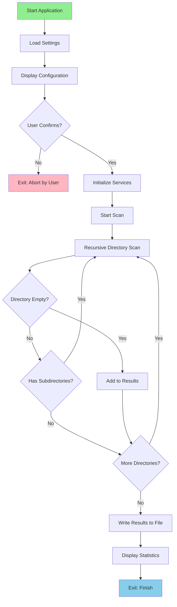

# Empty Directories

Empty Directories is a robust Node.js utility designed to automate the process of cleaning up file systems by identifying redundant, empty folders. this tool recursively scans a user-defined target path, efficiently detecting directories that contain no files or sub-directories.

Built in April 2021, it provides a detailed, organized log of all findings in a TXT file, allowing users to review results before taking action. Beyond simple scanning, the application features customizable ignore paths and a built-in backup mechanism to ensure data safety and transparency during the cleanup process.

## Features

### Core Capabilities

- 📁 Recursively scans directories from a specified path
- 🔍 Identifies all empty directories
- 📝 Generates a detailed log file with all findings
- ⚙️ Configurable ignore paths for flexibility
- 🛡️ Interactive confirmation before execution
- 💾 Backup functionality for the application itself
- 📊 Progress tracking during scan operations

### Technical Excellence

- **Modular Design**: Clear separation between core models, services, and application logic.
- **Robust Error Handling**: Unique error codes for precise troubleshooting and debugging.
- **Clean Codebase**: Adheres to modern JavaScript standards and best practices.
- **Dependency Management**: Minimal dependencies, relying on proven libraries like `fs-extra`.

### Developer Experience

- **Simple Configuration**: Centralized settings file for easy customization.
- **Detailed Documentation**: Clear instructions for setup, usage, and extension.
- **Built-in Tooling**: Includes linting and backup scripts for maintenance.
- **Transparent Execution**: Provides real-time progress updates during operations.

## Getting Started

### Prerequisites

- Node.js (v12 or higher)
- npm

### Installation

1. Clone the repository:

```bash
git clone https://github.com/orassayag/empty-directories.git
cd empty-directories
```

2. Install dependencies:

```bash
npm install
```

### Configuration

Edit the settings in `src/settings/settings.js`:

- `SCAN_PATH`: The absolute path to scan (e.g., `C:\\Or\\Web`)
- `DIST_FILE_NAME`: Name for the output log file (default: `result-log`)
- `APPLICATION_NAME`: Application name for path calculations
- `IGNORE_DIRECTORIES`: Directories to exclude from backup operations
- `MILLISECONDS_END_DELAY_COUNT`: Delay before exiting (default: 1000ms)

Configure paths to ignore during scan in `src/configurations/ignorePaths.js`:

```javascript
module.exports = [
  'node_modules',
  '.git',
  'dist',
  // Add more paths to ignore
];
```

## Available Scripts

### Scan

Scans for empty directories and generates a log file:

```bash
npm start
```

### Backup

Creates a backup of the application:

```bash
npm run backup
```

### Lint

Checks code for linting errors:

```bash
npm run lint
```

## Project Structure

### Directory Structure

```
empty-directories/
├── src/
│   ├── configurations/  # Configuration files (ignore paths)
│   ├── core/
│   │   ├── enums/       # Enumeration definitions
│   │   └── models/      # Data models
│   ├── logics/          # Main application logic
│   ├── scripts/         # Script executables
│   ├── services/        # Business logic services
│   ├── settings/        # Application settings
│   ├── tests/           # Test files
│   └── utils/           # Utility functions
├── dist/                # Output log files
├── backups/             # Application backups
└── package.json
```

## Architecture Principles

This project follows clean architecture principles:

1. **Single Responsibility**: Each service and utility has a clearly defined, singular purpose.
2. **Configurability**: Application behavior is driven by settings, not hardcoded values.
3. **Reliability**: Integrated error handling ensures graceful failures and informative feedback.
4. **Maintainability**: Organized directory structure and consistent naming conventions.

## Architecture

The application is built on a service-oriented architecture:

- **Core Layer**: Defines the fundamental data models and enumerations.
- **Service Layer**: Handles specific business logic like scanning, path validation, and logging.
- **Logic Layer**: Orchestrates services to perform high-level application flows.
- **Utility Layer**: Provides cross-cutting functions for file operations and system tasks.

## Design Patterns

- **Service Pattern**: Business logic is encapsulated in dedicated service modules.
- **Model-View-Controller (Simplified)**: Separates data models from the logic and console output.
- **Command Pattern**: Scripts act as entry points for specific application commands.

## How It Works



## Application Flow

1. **Configuration Loading**: Reads settings from `src/settings/settings.js`
2. **User Confirmation**: Displays key settings and prompts for confirmation
3. **Service Initialization**: Initializes all required services (log, path, scan, count limit)
4. **Directory Scanning**: Recursively scans the specified path
5. **Empty Detection**: Checks each directory for files and subdirectories
6. **Filtering**: Applies ignore paths to skip unwanted directories
7. **Logging**: Records all empty directories found
8. **Report Generation**: Creates a TXT file in the `dist/` directory
9. **Cleanup**: Performs graceful shutdown with statistics

## Usage Example

```bash
$ npm start

===IMPORTANT SETTINGS===
SCAN_PATH: C:\Or\Web
DIST_FILE_NAME: result-log
========================
OK to run? (y = yes)
y
===INITIATE THE SERVICES===
===SCAN DIRECTORIES===
C:\Or\Web\OldProject\EmptyFolder
C:\Or\Web\Archive\UnusedDir
C:\Or\Web\TestData\TempDir
===EXIT: FINISH===
```

The output file `dist/result-log.txt` will contain:

```
C:\Or\Web\OldProject\EmptyFolder
C:\Or\Web\Archive\UnusedDir
C:\Or\Web\TestData\TempDir
```

## Best Practices

- **Verify SCAN_PATH**: Always double-check the target directory in `settings.js` before running.
- **Use Ignore Paths**: Configure `ignorePaths.js` to exclude large, irrelevant folders (e.g., `.git`, `node_modules`).
- **Review Logs**: Examine the generated `result-log.txt` in the `dist/` folder before taking cleanup actions.
- **Regular Backups**: Use `npm run backup` before making significant changes to the application or target paths.

## Development

The project uses:

- **Node.js** for runtime
- **fs-extra** for enhanced file operations
- **ESLint** for code linting
- **readline-sync** for user input

## Contributing

Contributions to this project are [released](https://help.github.com/articles/github-terms-of-service/#6-contributions-under-repository-license) to the public under the [project's open source license](LICENSE).

Everyone is welcome to contribute. Contributing doesn't just mean submitting pull requests—there are many different ways to get involved, including answering questions and reporting issues.

Please feel free to contact me with any question, comment, pull-request, issue, or any other thing you have in mind.

## Support

For questions, issues, or contributions:

- **GitHub Issues**: [https://github.com/orassayag/empty-directories/issues](https://github.com/orassayag/empty-directories/issues)
- **Email**: orassayag@gmail.com

## Author

- **Or Assayag** - _Initial work_ - [orassayag](https://github.com/orassayag)
- Or Assayag <orassayag@gmail.com>
- GitHub: https://github.com/orassayag
- StackOverflow: https://stackoverflow.com/users/4442606/or-assayag?tab=profile
- LinkedIn: https://linkedin.com/in/orassayag

## License

This application has an MIT license - see the [LICENSE](LICENSE) file for details.

## Acknowledgments

- Built for educational and research purposes
- Respects robots.txt and implements rate limiting
- Uses user-agent rotation to avoid detection
- Implements polite crawling practices
